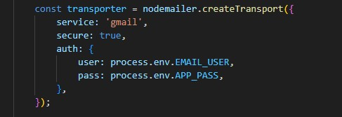

# Advanced Web Application Project 

Our group project is about creating a web-based automated parcel delivery system which includes 4 separate applications for different user roles. These are Consumer User App, Delivery Truck Driver App, Touchscreen App, and Parcel Generator “robot” App. 


## Consumer User GUI Application
This application is designed for users who want to send and receive parcels through the system. The user needs to have an account to use the application. The GUI allows consumers to register, login, view the account information, and delete their own account. The logged in users can initiate parcel deliveries, view their own history regarding sent parcels and received parcels, and are able to see the notification if there are incoming parcels via the system. The application is responsive to different screen sizes which give users the flexibility to access the system from various devices.
Receiver will get email notifications from system, knowing they will have incoming parcel if they are not registered user.

## Delivery Truck Driver GUI Application
This application is designed for one delivery truck driver who picks up senders’ drop-off parcel and delivers parcels to receiver between 5 different parcel locker locations. The driver collects sender drop-off parcels from drop-off lockers and delivers these to selected locker locations for the receiver to pick up. The GUI assists the driver in managing and tracking parcel deliveries, including drop-offs and pickups, in different locker locations. After the driver has delivered a package to a correct pick-up locker, the Driver App will send email-notification including pick-up information to the receiver. 

## Parcel Locker Touch Screen Simulation GUI Application
This application simulates the touch screen device at a parcel locker location for user interaction. It allows users to enter PIN code for either to drop-off or to pick-up with drop-off or pick-up locker number a parcel from a locker cabinet. The Touch Screen Simulation App verifies the inserted PIN code and directs the user to the correct locker cabinet to drop-off or pick-up a parcel. 

## Parcel Generator "Robot" Backend Application
This is a backend application which is responsible for automatically generating new parcel deliveries for randomly selected consumer users. The Parcel Generator “Robot” simulates the process of creating new parcels for the driver to deliver, thus initiating the delivery process.
## Description of the technologies used in the project
### Front-end part for all applications
- Node.js React framework and TypeScript
- Bootstrap CSS framework and Font Awesome icons for styling
- JWT (JSON Web Tokens) for authentication across HTTP requests
- Leaflet opensource JS map library

### Delivery Truck Driver GUI Application - frontend
- Next.js React framework and TypeScript
- Tailwind open-source CSS framework for styling
- Leaflet JavaScript library to create an interactive map

### API (backend part) for all applications
- Express – Node.js web framework and TypeScript for backend REST API
- Dotenv library to manage environment variables from .env file
- Cors mechanism enabling client side to connect with server side
- Concurrently library for compiling TypeScript to JavaScript
- In addition, Consumer User App includes Crypto-hash for encrypting user password, and JsonWebToken library to create authentication web token
- In driver application, Nodemailer module used to send email notifications.


## Project Team Members

- [Cheng Shufen](https://github.com/ofiscarlett) : Full-stack development (user app: register, sign-in and user authentication, delete user account).
- [Liisa Törmäkangas](https://github.com/liisatormakangas) : Full-stack development (user app: front page, home page, sent and received parcel history; locker touch screen app: welcome page; driver app: locker details view, parcel delivery from drop-off locker).
- [Shehara Wadu Mesthri](https://github.com/WMSShehara) : Full-stack development (locker touch screen app: pickup and drop-off confirmation; driver app: select locker and parcel delivery to pick-up locker, map integration).
- [Nguyen Thi Huyen](https://github.com/Nguyen-Thi-HuyenK) : Full-stack development (user app: sending parcel, testing plan, React tests, API tests).


## Run Locally

### Prerequisites

- Install [Node.js](https://nodejs.org/en) to run JavaScript on the server side. npm (node Package Manager) is typically installed with Node.js.
-  Install and set up MySQL database system and create database for the application. (db.sql file includes database queries)
- Clone the repositories to your local computer, and navigate to the relevant folder
```bash
  git clone [url]
  cd [repository name]
```
### Backend and frontend setup
- install the dependencies
```bash
 npm install
```
- Create .env file in the backend repositories where you can store your DB_HOST, DB_NAME, DB_PASSWORD. 
- For driverapp backend, in model/dropoff_model: add necessary values for these parameters in .env file. (use app password ([eg: google app password](https://support.google.com/mail/answer/185833?hl=en)) of your email)
  


- Start backend server 
```bash
 npm rundevStart
```
- Start frontend development server in Next.js app
```bash
 npm run dev
```
Open [http://localhost:3000](http://localhost:3000) with your browser to see the result.

